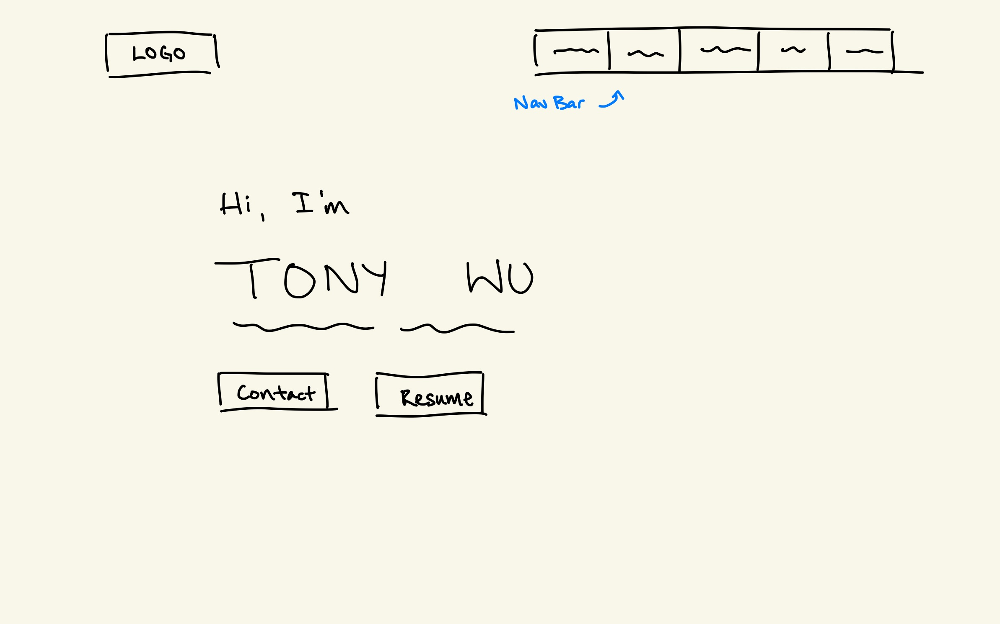
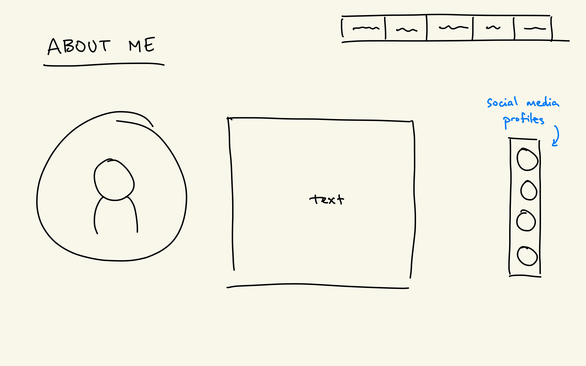
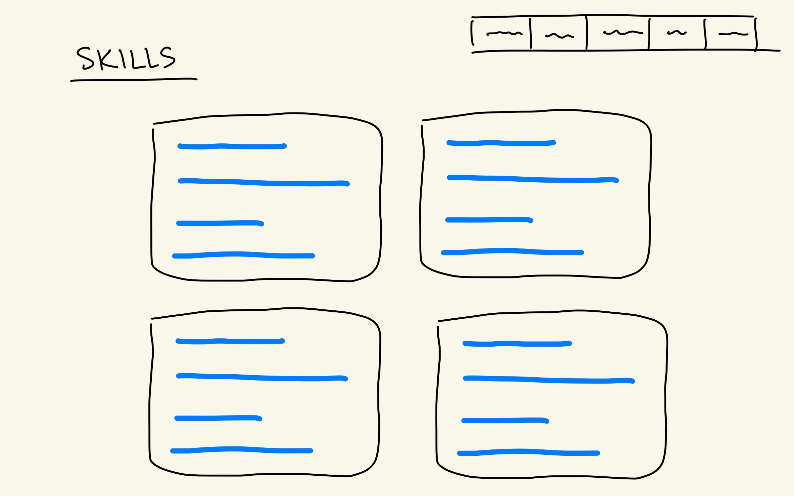
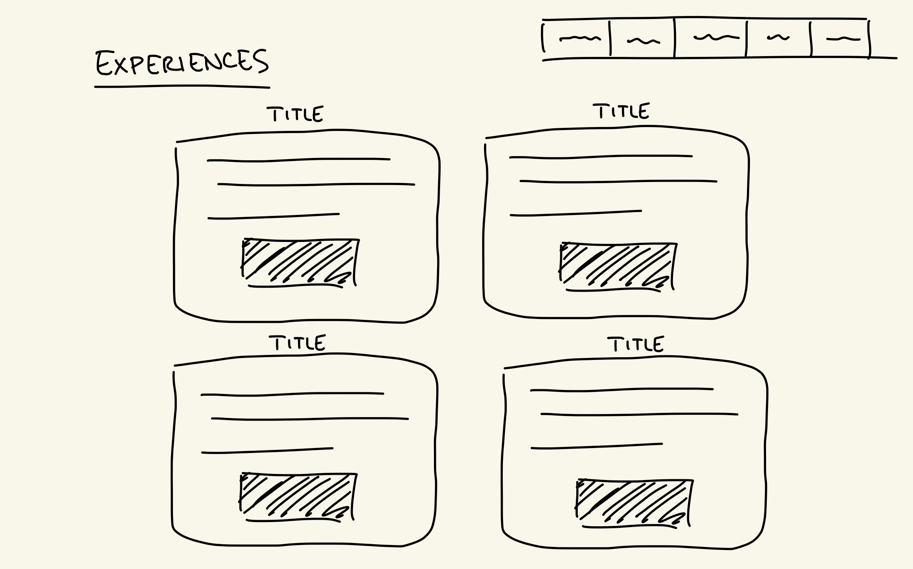
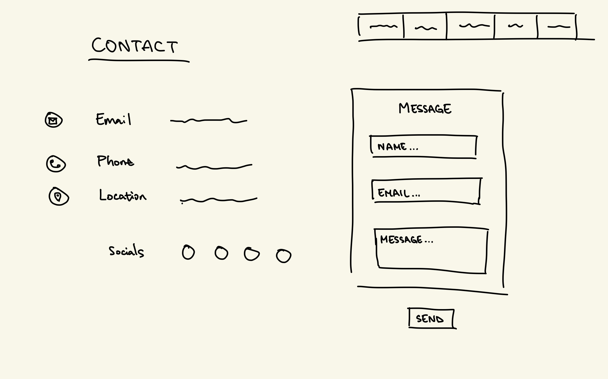

# CMPT 276 Mini Project 

# AI Declaration Form
[View AI Declaration PDF](public/Mini_Project_AI_Declaration_Tony_Wu_301556479.pdf)

# Why I chose MIT License
When I first set up my repository, I chose it because it was the one that was introduced to us in class. However, after doing some further research on my own, and comparing it with some of the other licenses, it did feel the most appropriate. As one of the most popular open-source licenses, it allows others to use my code freely to do whatever they wish, still remaining credit for myself, and also protects me from any liability issues that my code may end up causing. 

# Resources/Open Source Code Used in My Project
[Resource 1: Tutorial I used for majority of website setup and learning the basics of React/Tailwind](https://youtu.be/ifOJ0R5UQOc?si=XE11-qhQhTAS3VqZ)

[Resource 2: Used for Socials Buttons](https://uiverse.io/aadium/proud-swan-48)

[Resource 3: Used for Skills Bar](https://uiverse.io/Juanes200122/yellow-dog-17)

# Wireframes
## Hero Section

- Nav bar at the top, along with logo
- Greeting message
- Can include additional buttons like contact and resume download if time allows

## About Section

- Profile image
- Summary of an introduction of me

## Skills Section

- List of skills and proficiency, both technical and non-technical

## Experiences Section

- List out all my experiences -- each with image(s) and link to work

## Contact Section

- Contact information
